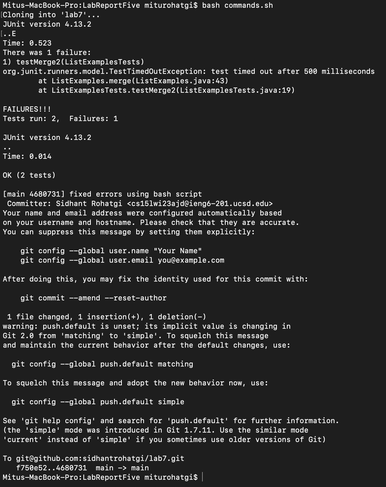
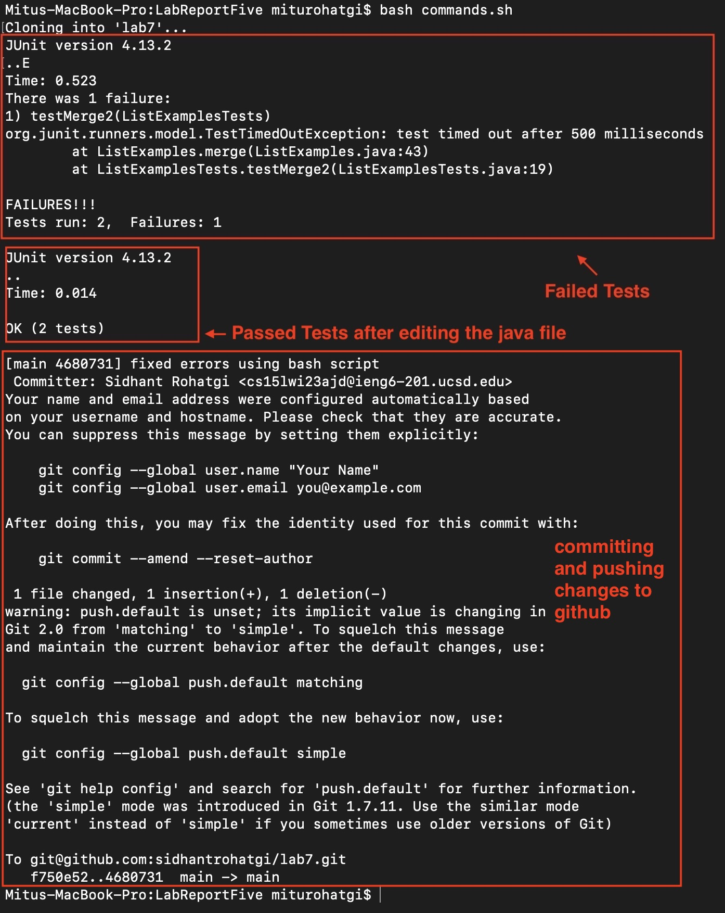
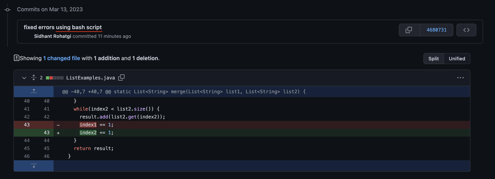

# **CSE 15L Lab Report Five**

In this lab report, I will look back at Lab Report Four and make a bash script to complete all the tasks very quickly. 

Steps (4 - 9):

- Log into ieng6
- Clone your fork of the repository from your Github account
- Run the tests, demonstrating that they fail
- Edit the code file to fix the failing test
- Run the tests, demonstrating that they now succeed
- Commit and push the resulting change to your Github account (you can pick any commit message!)

Assuming set up is already done (Steps 1 - 3), I made this bash script to perform all the steps mentioned above.

## Bash Script:

```
# Command to clone the forked repo
CLONE="git clone git@github.com:sidhantrohatgi/lab7.git;"

# Command to cd into the repo
CD="cd lab7/;"

# Command to compile tester file and java file
COMPILE="javac -cp .:lib/hamcrest-core-1.3.jar:lib/junit-4.13.2.jar *.java;"

# Command to run tests
RUN="java -cp .:lib/hamcrest-core-1.3.jar:lib/junit-4.13.2.jar org.junit.runner.JUnitCore ListExamplesTests;"

# Command to manipulate text file to fix error
FIX="sed -i '43s/index1/index2/g' ListExamples.java;"

# Command to add file using git
ADD="git add ListExamples.java;"

# Command to commit changes
COMMIT="git commit -m \"fixed errors using bash script\";" 

# Command to push changes
PUSH="git push;"

RESULT=$CLONE$CD$COMPILE$RUN$FIX$COMPILE$RUN$ADD$COMMIT$PUSH

# echo $RESULT

ssh -o StrictHostKeyChecking=no cs15lwi23ajd@ieng6.ucsd.edu $RESULT
```

I made separate strings for each command to ssh into the remote server and run them. Finally, I concatinated all of them into one string and passed that as an argument in the ssh command. 

One different command I used was `sed`, instead of `nano` to edit the contents of the java file. I passed in the specific line number to edit, along with the original string and the new string, and the filename. 

I also wrote `-o StrictHostKeyChecking=no` in the ssh command to make sure that it does not ask for fingerprint authentication.

Final ssh command:

`ssh -o StrictHostKeyChecking=no cs15lwi23ajd@ieng6.ucsd.edu $RESULT`

Command to run the bash script:
`bash commands.sh`

## Output:




## Output Explanation:




# Confirmation of Committed Changes on Github:


