# **CSE 15L Lab Report Four: CLDQ – CSE Labs “Done Quick”**

## Part 1: Logging Into ieng6

I opened a new terminal window and then pressed `^R` to search through the history of commands. Then, I typed in the term ```ssh```. This made the login command show up on my screen. To execute the command, I pressd `<enter>`


Successful Login Screen: 

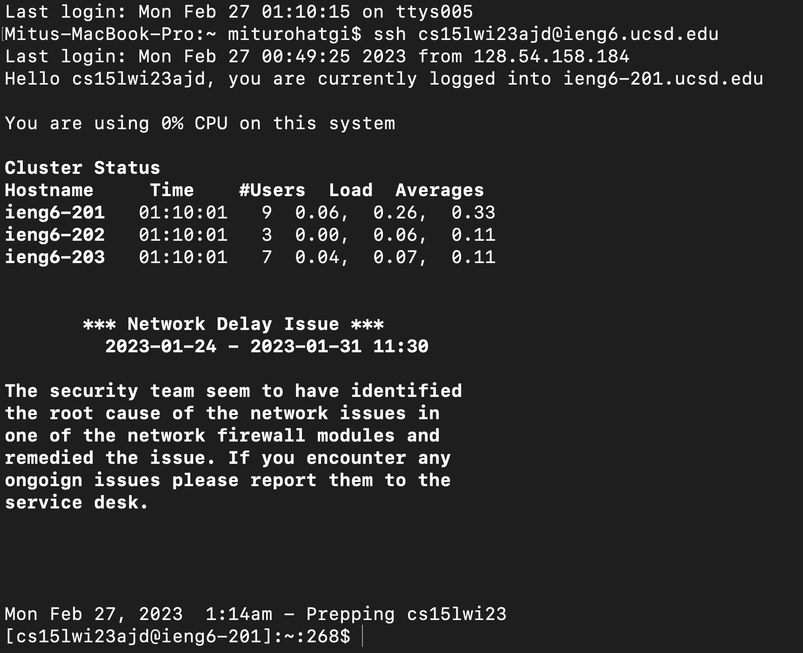

## Part 2: Cloning the Forked Repository

To clone the forked repository, I opened it in my web browser. Then, I clicked on the green "Code" button and copied the ssh link. 

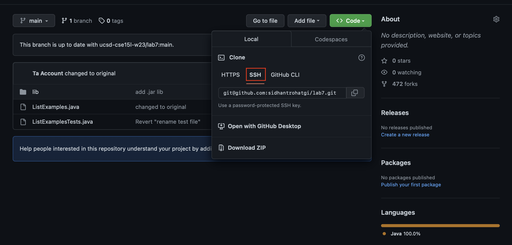

Then, I ran the command ```git clone <ssh url>```

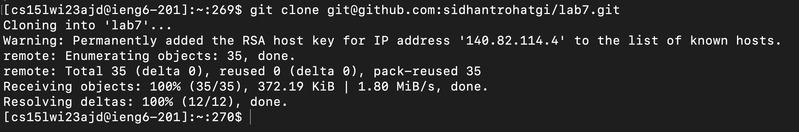

## Part 3: Running Tests

First, I changed my current directory to the cloned repository. To do this, I typed in ```cd``` followed by the letter ```l```, 


Then I pressed ```<enter>``` to auto-complete the command. 


To view the contents of the current directory, I used the command ```ls```

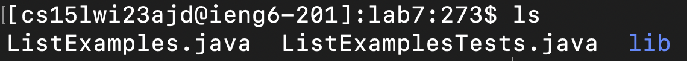

Then, I pressed `^R` to search through the history of commands. Firstly, I searched for ```*.java``` to find the command to compile all java files. I pressed ```<enter>``` to execute the command. 


Then, I searched for ```JUnitC``` to find the command to run the JUnit test. I used the arrow keys to edit the name of the test file at the end of the command ( Typed in ```L```, pressed ```<tab>```, typed ```T```, pressed ```<tab>```, pressed ```<backspace>``` to remove the ```.``` ). Then, I pressed ```<enter>``` to execute the command. 

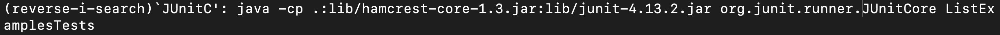

Failed Tests: 

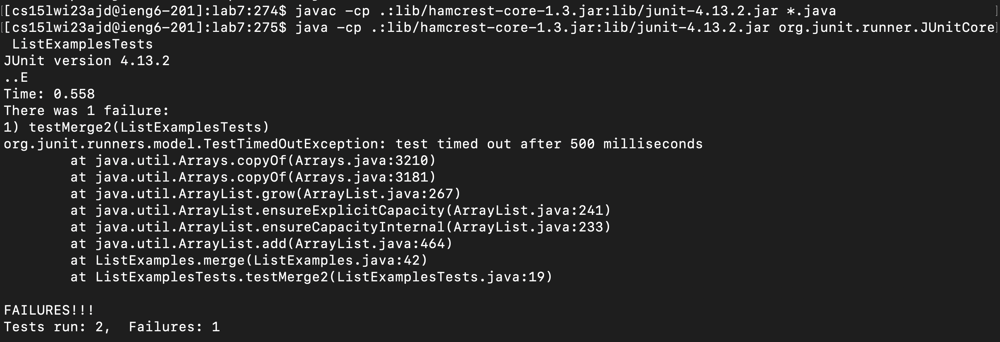

## Part 4: Editing code to fix errors

I typed ```nano L```, then pressed ```<tab>```, 


typed ```.j``` and pressed ```<tab>``` again to auto-complete. I pressed ```<enter>``` to execute the command.


Nano Editor:

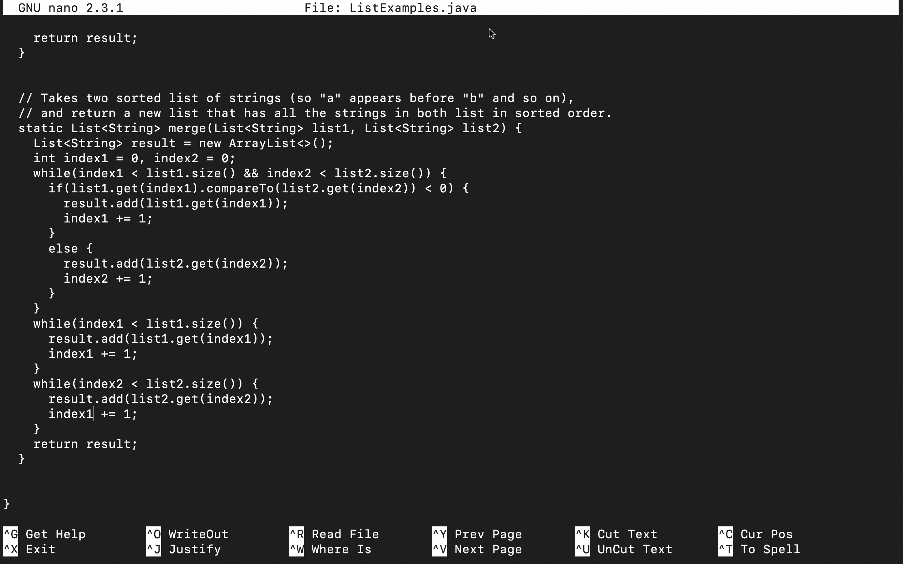

I then used the arrow keys to find and edit the java file to fix the error.

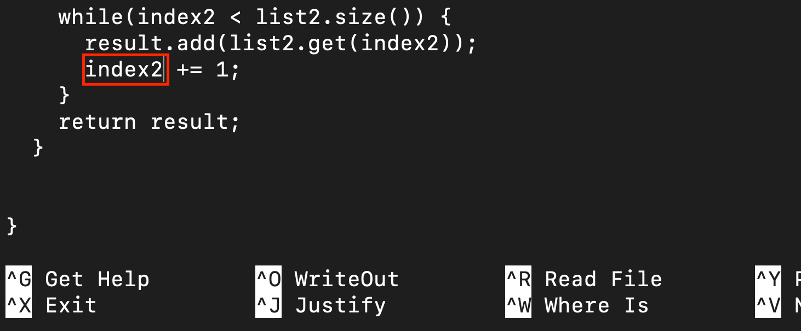

To save my changes, I pressed the keys ```^O``` followed by ```<enter>```. 


To exit out of nano, I pressed ```^X```.

## Part 5: Running Tests Again

The ```javac -cp .:lib/hamcrest-core-1.3.jar:lib/junit-4.13.2.jar *.java``` command was 3 commands up in the search history, so I pressed the ```<up>``` arrow thrice access it. 

Keys Pressed: ```<up><up><up><enter>```

The ```java -cp .:lib/hamcrest-core-1.3.jar:lib/junit-4.13.2.jar org.junit.runner.JUnitCore ListExamplesTests``` command was 3 commands up in the search history, so I pressed the ```<up>``` arrow thrice access it. 

Keys Pressed: ```<up><up><up><enter>```

Passed Tests:

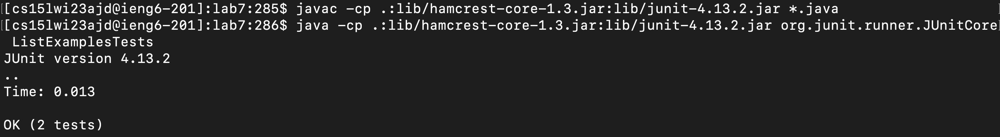

## Part 6: Committing and Pushing Changes

I typed in ```git add L```, pressed ```<tab>```, typed ```.j``` and pressed ```<tab>``` again to auto-complete. I pressed ```<enter>``` to execute the command.


Commit Command: ```git commit -m <message>```

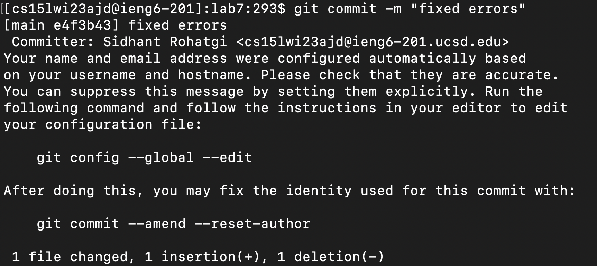

Push Command: ```git push```

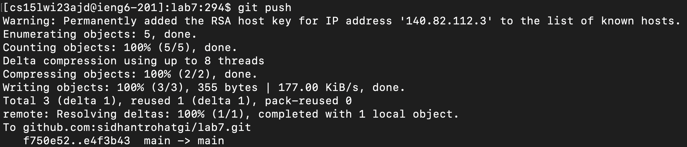

## Checking changes on Github:

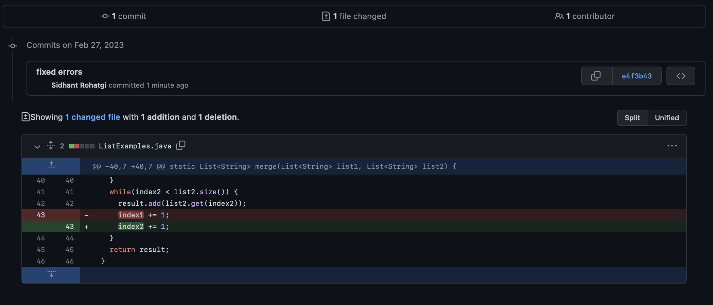