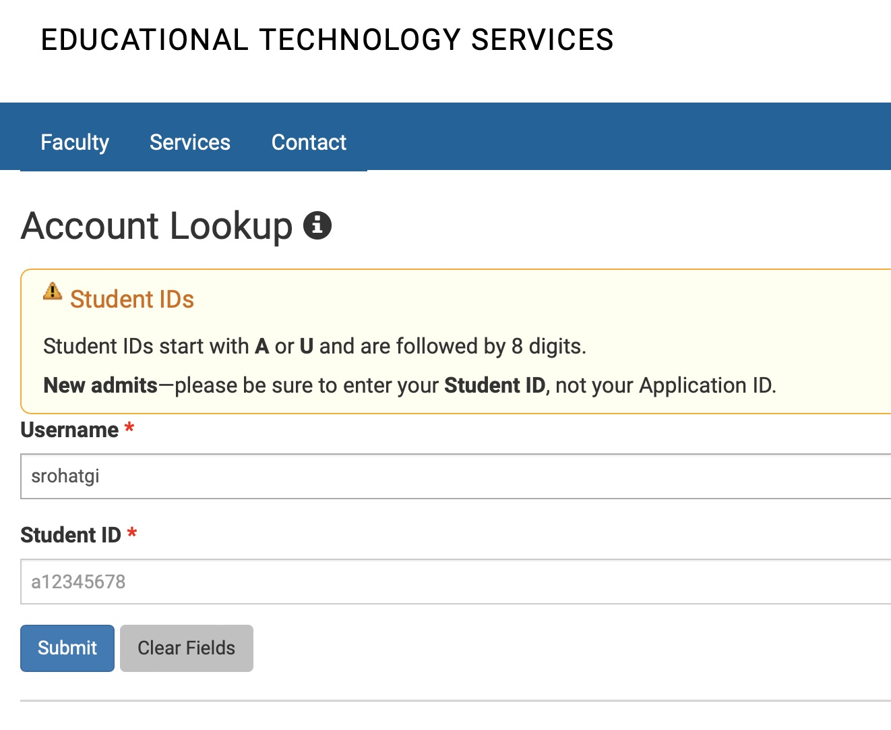
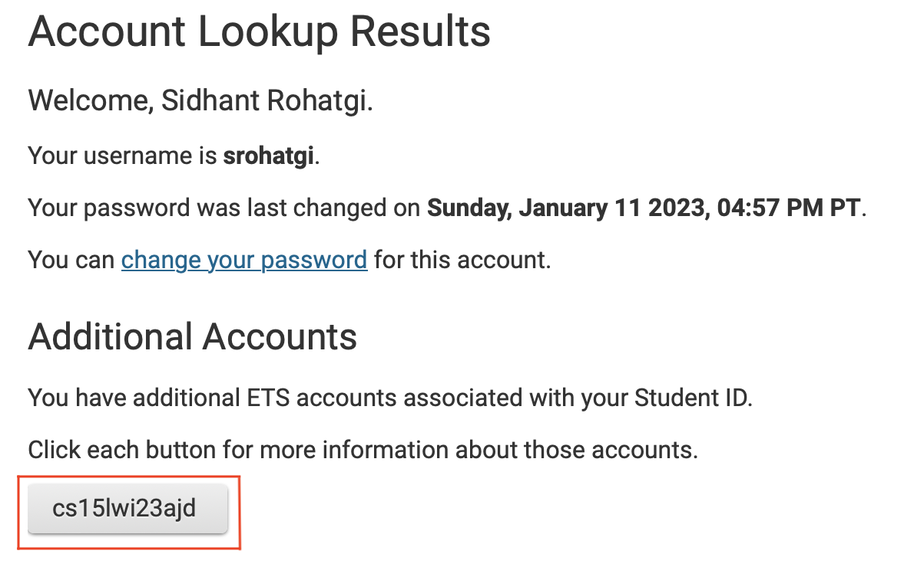
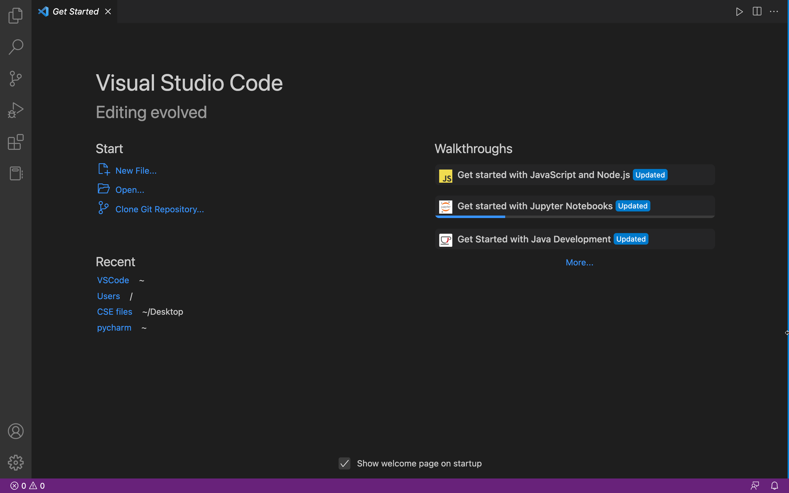
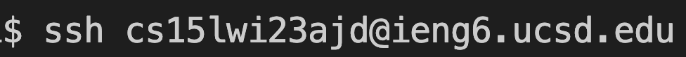
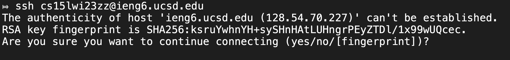
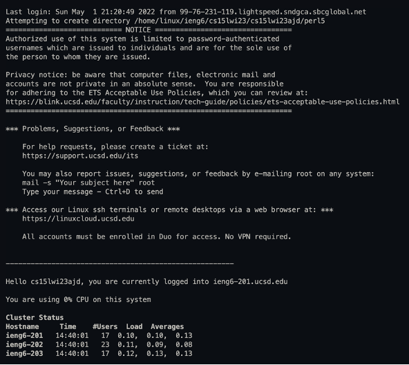
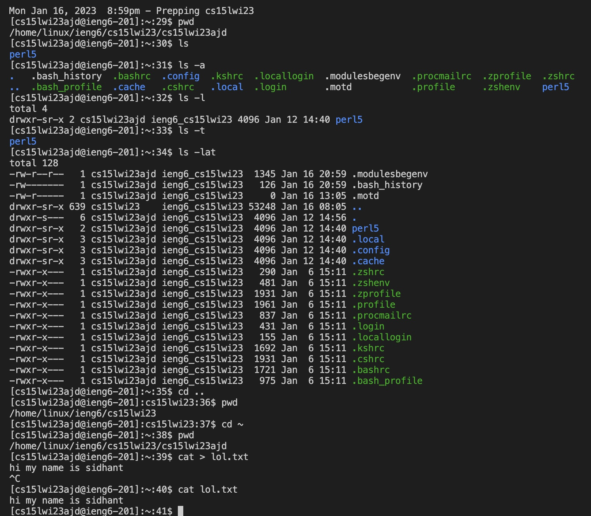

# **CSE 15L Lab Report One - Remote Access**

## Step 1 - Finding your CSE15L Account

Go to [https://sdacs.ucsd.edu/~icc/index.php](https://sdacs.ucsd.edu/~icc/index.php)

Enter your Username and Student ID (PID) in the account lookup section. 
Press Submit. 

Find your username under **Additional Accounts**. 

**Changing Password**

To Change your password, Click on 'change your password' and follow the on screen instuctions carefully. 

## Step 2 - Installing Visual Studio Code

Go to the [Visual Studio Code Website](https://code.visualstudio.com/Download) and download and install Visual Studio Code onto your computer. 

When you open VS Code, your window should look like this:

## Step 3 - Remotely Connecting

**Additional Step for Windows Users:** 
1. Download [Git for Windows](https://gitforwindows.org)
2. Open Visual Studio Code and press `Ctrl` + \` to open the terminal.
3. Press `Ctrl` + `Shift` + `P` to open the command palette.
4. Type `- Select Default Profile`. 
5. Select the Git Bash option and click on the + in the terminal window. 
6. The new terminal will now be a Git Bash terminal. 

Open a new terminal window in VSCode (`Ctrl` + `Shift` + \`) or (`control` + `Shift` + \`) 
Paste the following Command in the terminal and press enter. 
`ssh <your_username_here>@ieng6.ucsd.edu`

If you are logging in for the first time, you will get the following message: 

Type `yes` and press enter. 

You will then be prompted to enter your password.

Enter your password and press enter. (Don't worry if the password does not appear on screen as you type it!)

Congratulations, you are now logged into the server!

**Logging Out:**
To log out of the remote server, you can use either of the following options:
1. (`Ctrl` + `D`) or (`Cmd` + `D`)
2. `exit`

## Step 4 - Trying Some Commands

Try running some unix commands!

Some commands you can try:
1. `pwd` - prints the current working directory
2. `cd ~` - makes home the current working directory
3. `cd ..` - goes back one directory
4. `ls` - lists files and subdirectories in the current directory 
5. `ls -lat`- lists files and subdirectories, including hidden files in the current directory with more info
6. `cat` - command that reads files sequentially and writes them to standard output
7. `cat > filename` - creates file
8. `touch` - command to used to create, change and modify timestamps of a file
9. `nano` - command to edit text in a file
10. `echo` - command that outputs the strings that are passed to it as arguments

