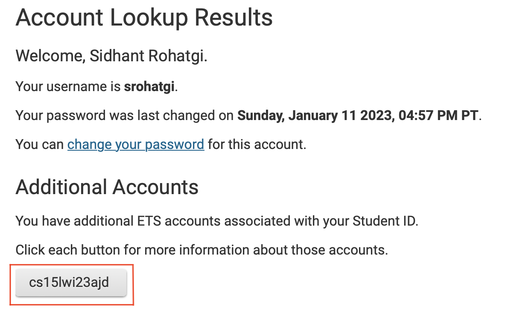

# **CSE 15L Lab Report One - Remote Access**

## Step 1 - Finding your CSE15L Account

Go to [https://sdacs.ucsd.edu/~icc/index.php](https://sdacs.ucsd.edu/~icc/index.php)

Enter your Username and Student ID (PID) in the account lookup section. 
Press Submit. 

Find your username under **Additional Accounts**. 

**Changing Password**

To Change your password, Click on 'change your password' and follow the on screen instuctions carefully. 

## Step 2 - Installing Visual Studio Code

Go to the [Visual Studio Code website](https://code.visualstudio.com/Download) and download and install Visual Studio Code onto your computer. 

When you open VS Code, your window should look like this 

