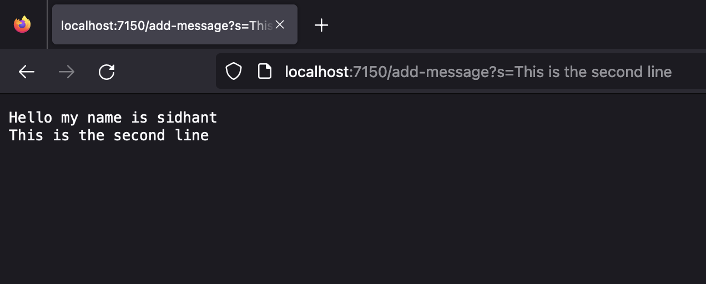
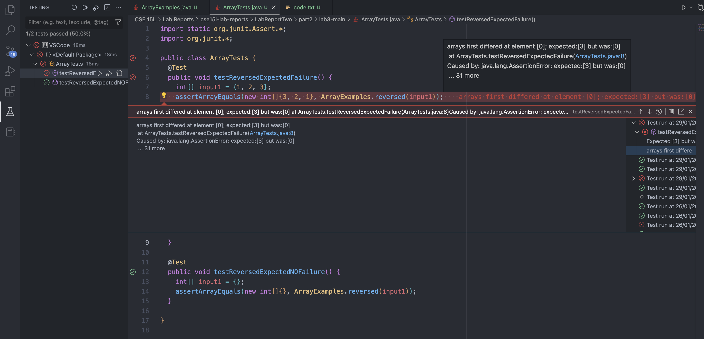
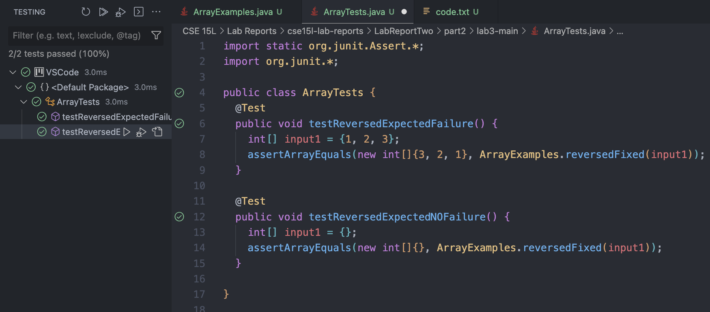

# **CSE 15L Lab Report Two - Servers and Bugs**

## Part 1 - Making a Web Server

StringServer Code:
```
import java.io.IOException;
import java.net.URI;

class Handler implements URLHandler {
    String outputString = "";

    public String handleRequest(URI url) {
        if (url.getPath().equals("/add-message")) {
            String query = url.getQuery();
            outputString += query.substring(2, query.length()) + "\n";
            return(outputString);
        }
        else {
            return "Error 404";
        }
    }
}

class StringServer {
    public static void main(String[] args) throws IOException {
        if(args.length == 0){
            System.out.println("ERROR - Missing port number! Try any number between 1024 to 49151");
            return;
        }

        int port = Integer.parseInt(args[0]);

        Server.start(port, new Handler());
    }
}
```

The server is started using the following commands:
```
user$ javac Server. java StringServer.java
user$ java StringServer 7150
```
When we start the server, the main method is called with the port as the command line argument. If the port is invalid or is not provided, an error message is displayed accordingly. 

When we enter the first URL, a request is sent to the `handleRequest` method. The method checks if the path of the URL is `/add-message` and displays the query, omitting the fist two characters, `s=` or displays an error message accordingly.


When the second URL is entered, the `handleRequest` recieves a request again. The query, followed by a newline character is concatenated to a string variable `outputString`, and the new output is displayed on screen. 



## Part 2 - Bugs

Buggy Code to return a new array with all the elements of the input array in reversed order:
```
  static int[] reversed(int[] arr) {
    int[] newArray = new int[arr.length];
    for(int i = 0; i < arr.length; i += 1) {
      arr[i] = newArray[arr.length - i - 1];
    }
    return arr;
  }
```

Failure Inducing JUnit Test:
```
  @Test
  public void testReversedExpectedFailure() {
    int[] input1 = {1, 2, 3};
    assertArrayEquals(new int[]{3, 2, 1}, ArrayExamples.reversedFixed(input1));
  }
```

**NON** Failure Inducing JUnit Test (On Buggy Code): 
```
  @Test
  public void testReversedExpectedNOFailure() {
    int[] input1 = {};
    assertArrayEquals(new int[]{}, ArrayExamples.reversedFixed(input1));
  }
```

Error Symptom: `arrays first differed at element [0]; expected:[3] but was:[0] at ArrayTests.testReversedExpectedFailure(ArrayTests.java:8)`

JUnit Test Results (for Buggy Code):



Fixed Code for the Reversed method:
```
  static int[] reversedFixed(int[] arr) {
    int[] newArray = new int[arr.length];
    for(int i = 0; i < arr.length; i += 1) {
      newArray[i] = arr[arr.length - i - 1];
    }
    return newArray;
  }
```

In the fixed code, the return value is the newArray instead of the array passed as the parameter. Additionally, thw arrays are switched while assigning values. 

JUnit Test Results (For Fixed Code):



## Part 3 - Learnings from CSE 15L Lab

Over the past 3 weeks, I:
- Familiarised myself with UNIX commands. 
- Learnt how to use the command line.  
- Learnt how to use git and Github to collaborate on projects. 
- Learnt how to start and run a web server locally. 
